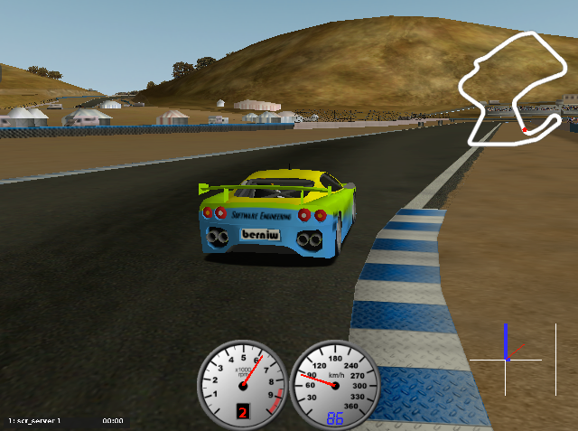

# torcs-node-client
torcs-node-client is Node.js client for running autonomous driver bots on [The Open Race Car Simulator](http://torcs.sourceforge.net/index.php) (TORCS).



# The Basics
TORCS is designed to enable pre-programmed AI drivers to race against one another, while allowing the user to control a vehicle using either a keyboard, mouse, or wheel input. In 2013, a patch was created to extend TORCS to support externally controlled robot drivers as part of the [Simulated Car Racing (SCR) Championship](https://arxiv.org/pdf/1304.1672.pdf). The torcs-node-client uses the SCR network protocol to simulate a driver. 

TORCS with the [SCR patch](https://github.com/fmirus/torcs-1.3.7) runs standalone in its own process to which this client connects and communicates over UDP on default port 3001. Every 20 ms TORCS sends a packet of sensor data for the simulated car and waits for commands. If no command is provided in the timeframe, the previous command is performed. This cycle continues until the race completes or your car crashes and sustains damage greater than the maximum damage setting. The

The default driver provided by this client is based on the [Pure Pursuit algorithm](https://www.ri.cmu.edu/pub_files/pub3/coulter_r_craig_1992_1/coulter_r_craig_1992_1.pdf).

# Prerequisites
You will need the following software installed:

* TORCS 1.3.7 or greater with the [SCR patch](https://github.com/fmirus/torcs-1.3.7) installed.

* GIT commandline tools or the equivalent

* Node.js version 12 or greater

* If you run TORCS on a separate machine you will need the machine's ip. On Windows machines use `ipconfig` to access it's IP address. On Linux use `ip a` for it's IP address.


# Getting Started
Open a command shell and `cd` to the folder that will contain your version of the torcs-node-client.

Clone this git repo
```
git clonde https://github.com/wayneparrott/torcs-node-client.git
```

Now let's build the package using the following commands:
```
cd torcs-node-client
npm i
npm build
```

Now launch the torcs-node-client.
```
node dist/index.js
```
or 
```
node dist/index.js --host <ipaddr> --port <default=3001>
```

Open a command shell and start TORCS.
```
torcs
```
From the TORCS graphical UI configure a race and your car as follows:

*Race > Quick Race > Configure Race > Accept > scr_server 1 driver > Accept > New Race*

TORCS will remember the race, driver and car settings for future races and you should start the race using this sequence:

*Race > Quick Race > New Race*

At this point, the torcs-node-client will connect to TORCS and begin sending steering, accelation, brake and gear shift commands. 

## Restart
By default the torcs-node-client will automatically restart a race when it's race car suffers excessive damage. Additionally you can manually restart a race by entering a `r` key in the command shell. 

# Pure Pursuit Driver
The PurePursuitDriver.ts is a basic robot driver that uses a variable lookahead distance that is a function of the car's velocity and the longest sensor range reading. The cross-track error angle is angle of the long sensor range reading. On long straights an drift component detects if the car is too close the track edge and will slight nudge it back over with an additional steering input.

The velocity and acceleration control (accelerator, brake and gear) are computed together using. A PD controller is computes an acceleration between [-1,1]. This is then converted to accelerator and brake inputs. Both instantaneous maximum accelerator and brake inputs are limited to minimize wheel spin and skidding. Braking is controlled when the car enters a braking zone. A braking zone is resides in front of each turn usually beginning around 75 meters and extending into the turn. Within a braking zone the the target speed is set to the minimun of longest sensor range reading or a minimun car speed, e.g., 50 kph. 

## Areas for Improvement
The result is a reasonably performant algorithm with additional room for such a simple controller. Because the steering controller uses the longest sensor range reading the car has a tendency to drive directly towards the apex of a turn rather than curve in to it. Additionally, over braking occurs on some turn segments. In such cases coasting or more liberal acceleration control would improve corner speed. A big future enhancement is to introduce a secondary controller that monitors and automatically tunes additional steering and acceleration parameters as the car learns the track. 


